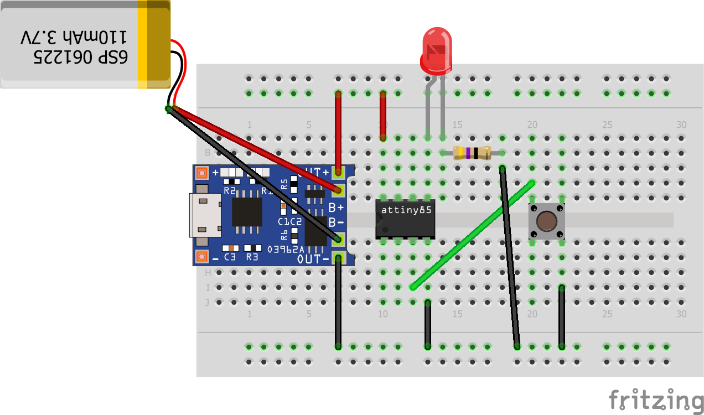

# Open Bike Light Project

The intent of this project is to create a modern, simple and fully customisable bicycle light.

There are many bike lights on the market, but I struggled to find one with all the charateristics I needed. Specifically, I wanted the freedom to 3D-print my own enclosure, I wanted it to be cheap, low-power, and I wanted to design my own light patterns and choose the LEDs to use. So I started this project

## Features

- **Cheap**: All the components I've used costed very few Euros, but it can cost way less if built in batches.
- **Ultra low power consumption**: When in sleep mode, it uses < than 2 uA, it's almost not measurable with my digital tester. When on, some patterns (like the sine blink) can last for >50 hours with a 500mA battery.
- **Open Hardware**: You can choose the LED types as well as the battery, to meet any possible requirement. You can also print your own enclosure to mount it wherever you want.
- **Open Software**: You can design any light pattern you want.
- **Simple to use**: I've tried to make an intuitive single button interface, to make the use obvious without the need to read a manual.
- **Funny**: This is a simple and yet challenging multidisciplinary project! It involves programming an ATTiny85 with an Arduino, playing with exotic low level functions as the Sleep mode and Interrupts, some basic circuit design and soldering, as well as designing/3D-printing the enclosure.

## Usage
I wanted the usage to be dead simple, this is how the single-button interface works

### When in sleep mode
- a long (> 500ms) click turns the light on with a nice fade in effect. When turned on, the light is in full power mode (state 1).

### When ON
- a single click rotates throught the available light patterns
- a very long (> 2 seconds) click turns the light off: the light emits 5 short blinks and goes in sleep mode.

## Light patterns

- **1**: 100% power
- **2**: 50% power
- **3**: 2 seconds ramp up (sawtooth) cycle
- **4**: half of the sine wave (sine blink? sinblink? sblink?)
- **5**: full sine wave cycle
- **6**: slow blink (1 second)
- **7**: fast blink (500ms)
- **8**: seizure attack blink (100ms)
- **9**: random power effect (I wanted it to look like a candle - but it looks like a broken light)

# How to make one

## Ingredients
- ATTiny 85
- A push button
- A battery. The ATTiny85 operates between 2.7 and 5.5 Volts, I suggest to use a 3.7-5V battery so that you can drive both the LEDs and the ATTiny with the same battery. It could be a 18650 but I've used a generic 3.7V 500mAh battery that lasts forever in blink mode.
- A TP4056 charger circuit, cheap and dead simple.
- An enclosure of your choice. You can print your own or just use a mint box.
- As many LEDs/resistors as you want*.

## Instructions
First of all, you need to configure Arduino as an ISP Programmer, and burn a bootloader on the ATTiny85

Personally, I've followed these instructions https://www.instructables.com/How-to-Program-an-Attiny85-From-an-Arduino-Uno/
But I had to struggle a lot, so I believe that a reliable set of instructions on how to program an ATTiny 85 with Arduino should be part of these instructions [TBD]

I made some instructions in the past, but I believe they are outdated now: https://dev.mikamai.com/2014/03/05/how-to-program-an-attiny85-or-attiny45-with-an/

Then you have to program the ATTiny with open_bike_light.ino and make a simple circuit like this one:

* You can use as many LED as you want, but the ATTiny85 can handle 40mA on a single pin. If you want to drive more than 2-3 LEDs you must use a transistor. If you use something like a TIP102 you can also drive a LED strip (while greatly increasing the power consumption)

Now you can start using it right away!!

## TODO

- Provide full and detailed instructions on how to program an ATTiny85 with Arduino, including different models (UNO, Yun, Leonardo, Zero, etc...).
- Design a PCB and add it to the project.
- Design some enclosures and add it to the project.
- Create different light patterns.
- My code sucks. There are no known bugs, but I'm clearly not a black belt in C programming and any help/advice/improvement is more than welcome.
- Drive an RGB Led rather than a single color
- Automatic power ON and OFF
- Add peripherials, like an accelerometer and a gyro

## How to participate to the project

Any help is more than welcome! Anything can be changed except for the one-button interface. The main features should be unchaged, so the power consumption in sleep mode should be unaltered or lower than the current (about 2uA). But apart from that, the code can be improved (and there is plenty of space for that), more fancy light patterns can be added. A very desirable feature would be to drive an RGB LED. The AtTiny85 has PWM only on 2 Pins, but I'm sure that with some black magic mojo jojo PWM could be added via software on a third pin, that would open to the magic of the RGB colored patterns! I'd also like to add some sensors (like an accelerometer and/or a gyro) to make dynamic light patterns (would be nice if it starts blinking when breaking or jumping) and also automatic power ON and OFF. However, this should not compromise the power consumption in a noticeable way.
